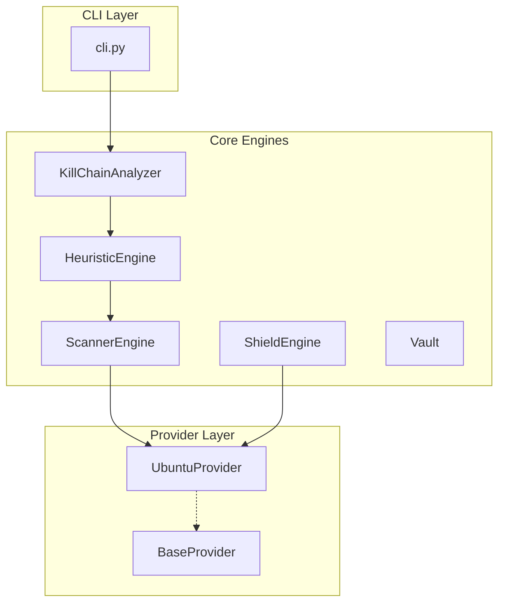

# Meteor Security CLI: Developer Guide 🛰️

Welcome to the technical deep-dive of **Meteor**. This guide explains the internal architecture, decision-making logic, and offensive security techniques implemented in the tool.

## 1. High-Level Architecture

Meteor follows a **Clean Architecture** approach, separating the OS-level data retrieval from the core heuristic analysis and the presentation layer (CLI).

## 2. Component Breakdown

### 🛡️ Providers (The OS Abstraction)
The `providers/` directory contains the logic for interacting with the operating system.
- **`BaseProvider`**: An abstract interface defining methods like `get_open_ports()`, `get_process_maps()`, and `get_security_logs()`.
- **`UbuntuProvider`**: Current implementation for Linux/Ubuntu systems. It uses `psutil` for basics and direct `/proc` and `/var/log` access for deep metrics.

### 🔍 Core Engines (The Brains)
- **`ScannerEngine`**: Handles standard network diagnostics.
- **`DeepScanner`**: Performs raw SYN scanning using `scapy` and validates process integrity via memory-file correlation.
- **`HeuristicEngine`**: Correlates ports to processes. It marks a process as **Red** if access to its executable path is denied—a common indicator of rootkits or process hollowing.

## 3. Advanced Security Techniques

### 🧠 Process Hollowing Detection
Meteor doesn't just check if the executable exists on disk. In **Combat Mode**, it reads `/proc/[pid]/maps` and identifies memory regions with the `x` (executable) bit set but no backing file on disk. These "Anonymous" executable regions are high-confidence indicators of code injection.

### 🔐 K-Anonymity (Privacy Guard)
To protect user privacy while checking for breached emails or passwords, Meteor implements **K-Anonymity**:
1. Hash the email/password locally using SHA-1.
2. Take ONLY the first 5 characters (prefix).
3. Send ONLY the prefix to the HIBP API.
4. The API returns a list of suffix hashes.
5. Meteor does the final matching locally.
*Result: Your full email/password never leaves your machine.*

### 🛡️ The Shield (Hardening Engine)
The `HardeningEngine` audits system-level security parameters:
- **ASLR Check**: Ensures `/proc/sys/kernel/randomize_va_space` is set to `2`.
- **Network Stack**: Audits `rp_filter` (IP Spoofing) and `accept_redirects` (MITM prevention).

## 🪐 Nebula UI System
The UI uses `rich.layout` to create a non-linear dashboard. It partitions the screen into regions, allowing us to display hardware vulnerabilities alongside network exposure for a better overview.

---

## 🛠️ Contribution Rules
1. **SOLID Only**: Never add OS-specific code directly to a Core engine. Add it to a Provider.
2. **Modular Engines**: Each engine should be able to run independently of the CLI context.
3. **Security First**: Always use K-Anonymity for any external API requests involving personal data.
